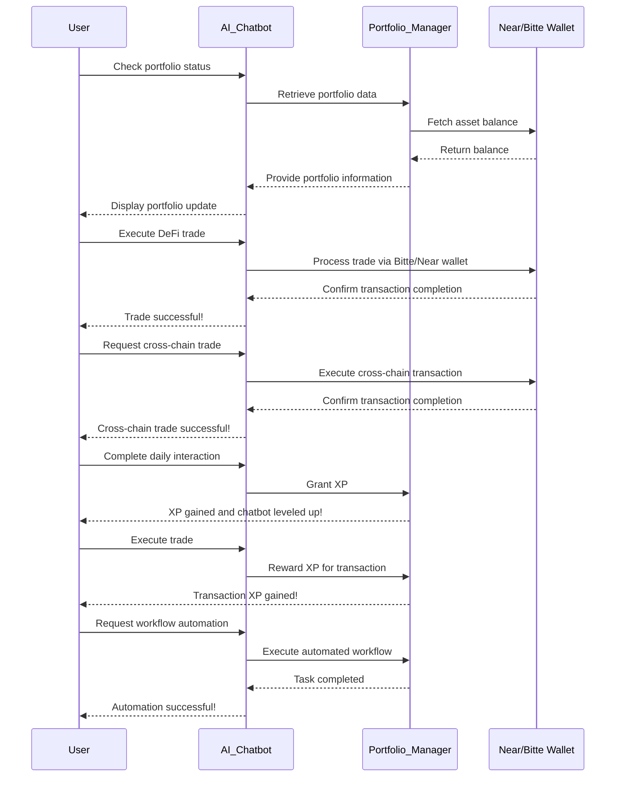

<h1 align="center">Nero</h1>
<h3 align="center">AI chatbot-based portfolio management and DeFi automation platform</h3>

  <a href="https://nero-kappa.vercel.app/" style="color: #a77dff">Platform</a> | <a href="https://www.figma.com/deck/jQVi1FAhWle4eOBR0V2JZg" style="color: #a77dff">Pitchdeck</a> | <a href="https://youtu.be/xOrMul_weBI" style="color: #a77dff">Demo Video</a>

<h2 align="center">Sponsor (Click on the logo)</h2>

<a href="https://github.com/aki-0517/Nero/blob/main/components/nero-chat.tsx" height="5" width="10" target="_blank">
	
<a><a href="https://github.com/aki-0517/Nero/blob/main/lib/bitte-wallet.ts" height="5" width="10" target="_blank">
	
<a><a><a href="https://github.com/aki-0517/Nero/blob/main/components/nero-chat.tsx" height="5" width="10" target="_blank">
	

---

## Overview  
Our project is an AI chatbot-based portfolio management and DeFi automation platform. By incorporating gamification, users can track their assets, execute trades, and grow their AI agents, making portfolio management a fun and educational experience.  

## Problem  
1. **Complex DeFi Management** – Managing multiple wallets and DeFi transactions is challenging.  
2. **Lack of Engagement** – Traditional portfolio trackers only provide data without user interaction.  
3. **User Retention Issues** – Existing financial tools struggle to keep users engaged over time.  
4. **Beyond Simple Automation**  
   - Unlike traditional DeFi agents that focus solely on automating trades or promoting content on Twitter, our AI agent actively interacts with users.  
   - It allows users to explore various networks and ecosystems, engage in conversations, and gain experience rather than just passively managing portfolios.  
   - Users can learn and grow their assets while expanding their financial knowledge through chatbot interactions.  
   - The chatbot isn't just a guide—it’s a character that gains experience through transactions and interactions, evolving into a more advanced portfolio manager.  
   - This approach transforms DeFi trading and portfolio management into a fun, engaging, and educational experience rather than just another financial tool.  

## Solution  
1. **AI-Powered DeFi Management** – The AI agent automates DeFi transactions like swaps, bridges, and staking, simplifying portfolio management.  

2. **Interactive & Gamified Experience** – Users earn experience points (XP) through transactions and chatbot interactions, leveling up their agent bot as a personalized digital asset manager.  

3. **Educational & Engaging Learning** – Users explore multiple networks, learn about DeFi through conversations, and grow both their portfolio and financial knowledge in a fun, engaging way.

## Sponsor track
### 1. Bitte wallet:
- We utilized the Bitte Wallet to enable secure user authentication and transaction capabilities within our React application. By integrating the Bitte Wallet, users can seamlessly log in and execute transactions within the NEAR Protocol ecosystem.

### 2. Proximity Labs (Cross-chain Trading Agents):
- We integrated NEAR Intents into our application by utilizing the NEAR Intents smart contract (intents.near) and the solver network to determine optimal execution paths for cross-chain swaps. This setup allows users to perform cross-chain swaps efficiently, with the NEAR Intents contract fulfilling requests and utilizing cross-chain bridges as needed to settle intents across different chains.

### 3. Questflow:
- We integrated Questflow into our chat interface, enabling users to interact with AI-driven agents for tasks such as strategic trading, airdrops, and data analysis. By leveraging the Questflow developer platform and NEAR SDK, we created user-friendly tools and agents that can be operated directly through the chat interface, enhancing the overall user experience.

## Key Features 
1. **AI Agent for DeFi Management** – Automates swaps, bridges, and staking to optimize portfolio management.  
2. **Gamified Experience** – Users earn XP through transactions and chatbot interactions, leveling up their agent bot.  
3. **Personalized AI Companion** – Each agent bot evolves uniquely based on user engagement and trading activity.  
4. **Multi-Network & Cross-Chain Support** – Enables seamless transactions across various blockchain ecosystems.  
5. **Educational Chatbot** – Provides real-time insights, DeFi education, and market updates through interactive conversations.  
6. **Daily Quests & Rewards** – Encourages user engagement with tasks that offer XP and additional incentives.  
7. **Customizable Character Growth** – Users can shape their agent bot’s appearance and abilities as it levels up.

## Business Model  
**1. Subscription & Premium Features**  
- **Free Tier** – Basic portfolio tracking and chatbot interactions.  
- **Premium Subscription** – Advanced DeFi automation, personalized insights, and enhanced AI analytics.  
- **NFT-Based Access** – Exclusive features for users holding chatbot character NFTs.  

**2. Transaction & Ecosystem Fees**  
- **DeFi Transaction Fees** – Small percentage fee on automated swaps, staking, and bridging.  
- **Marketplace Revenue** – Revenue from trading chatbot character NFTs.  
- **Partnerships & Integrations** – Collaborations with DeFi protocols for integrated services and revenue-sharing models.

## Diagram (Mermaid Code) 

## Project Timeline 

**Q1 – MVP Completion & Core Integrations**  
- Finalize **MVP development**  
- **Bitte wallet**, **Questflow**, **Proximity** integration

**Q2 – Expansion & Widget Development**  
- Develop **Chatbot Widget Chrome Extension**  
- Begin **Mobile Widget Development**  

**Q3 – Gamification & NFT Integration**  
- Develop **Dynamic NFT Smart Contract** for chatbot characters  
- **Mint & Launch 12,000 Chatbot Character NFTs**  

**Q4 – Advanced AI & DeFi Optimization**  
- Release **Agent DeFi Analysis & Learning v2.0** for enhanced portfolio management and automation  
